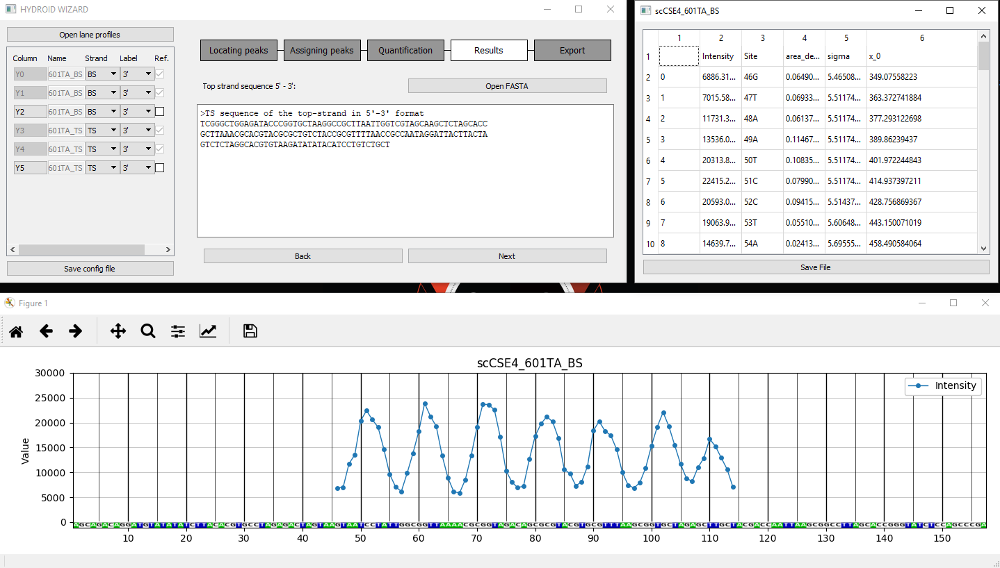

# HYDROID_GUI
GUI for HYDROID - Python package for analyzing hydroxyl-radical footprinting experiments of protein-DNA complexes (https://github.com/ncbi/HYDROID)
## This is a simple gui for hydroid_exp module

## Installation
HYDROID_GUI gui is tested to work on python 2.7 through conda environment manager, it runs on Linux (ubuntu 16.04, 14.04 tested), Windows and MacOS
### install hydroid
- conda install -c hydroid hydroid
- conda install pyqt
- conda install -c conda-forge billiard
### clone this repo
- git clone https://github.com/intbio/HYDROID_GUI
- cd hydroid gui
### run 
- python hydroid_gui
